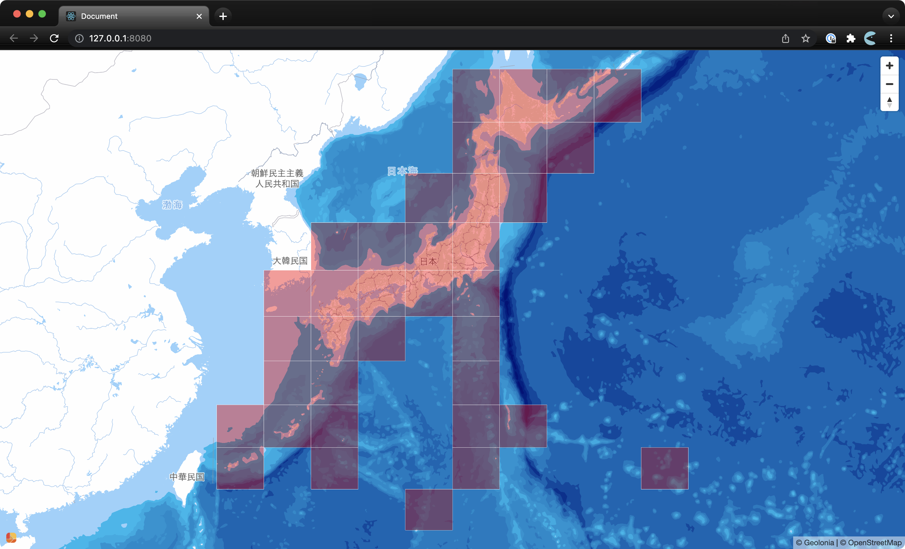
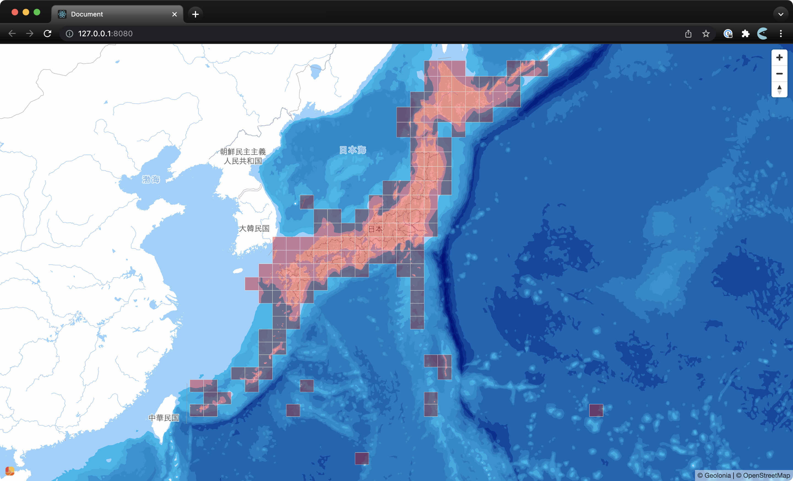

# anymesh

Anymesh is a mesh generating library which fills a given GeoJSON with any resolutions.

<figure>
  
  <figcaption>in 10x10</figcaption>
</figure>

<figure>
  
  <figcaption>Japan in 30x30</figcaption>
</figure>

## install

```shell
$ npm install https://github.com/kamataryo/anymesh
```

## API

```typescript
const anymesh = new AnyMesh(geojson: GeoJSON.FeatureCollection, x: number, y: number);
```

### parameters

- `geojson`: GeoJSON to be filled.
- `x`, `y`: tile numbers to fill the GeoJSON.

## Usage

Anymesh is a stream to generate squared feature one by one.

```typescript
import { Anymesh } from 'anymesh'

const japan = 'https://github.com/dataofjapan/land/raw/master/japan.geojson'
const resp = await fetch(japan)
const geojson = await resp.json() as GeoJSON.FeatureCollection

for await (const feature of new Anymesh(geojson, 3, 3)) {
  console.log(feature)
}
```

### CLI

Receive GeoJSON from stdin and pass the result to stdout.

```shell
$ curl https://github.com/dataofjapan/land/raw/master/japan.geojson -sL | npx ts-node src/cli.ts 3 4
```
